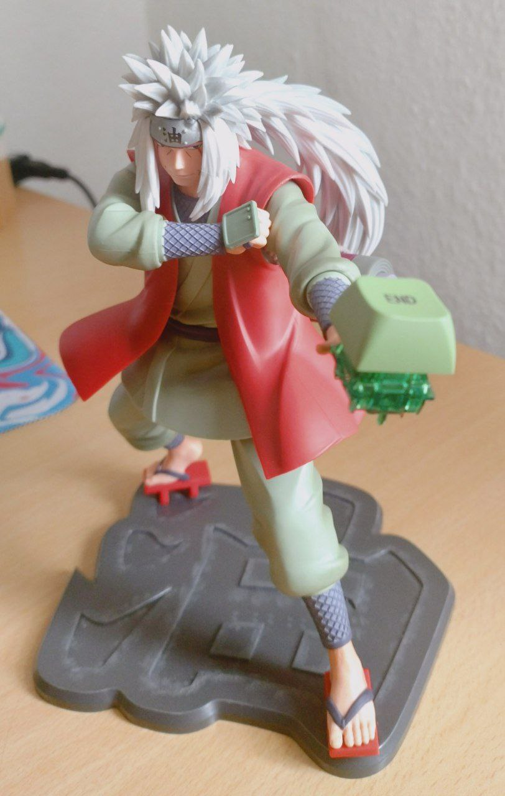

# ToadsTempest

## Intro

I want to be savage, I like Jiraiya a lot, I want to participate in a challenge.
This project is in intersection of those three ideas. Also I was surprised about possibilities of [F.A.K.](https://github.com/semickolon/fak?tab=readme-ov-file) and resourses like [Keyboard Builders' Digest](https://kbd.news/).

So, after some times I made this:

Super small custom 42-keys column-staggered ergonomic mechanical keyboard powered by CH552T microcontroller, created for [pocket keyboard design contest #00](https://chrischrislolo.github.io/orthoLabLogs/pocket-keyboard-design-contest-00.html)

## Idea

My idea was to design a keyboard that could offer a typing experience comparable to keyboards using Novelkeys Cream Clickie switches. I accidentally stumbled upon [Teardown video](https://youtu.be/nNLSzOhqwmU?list=PL285ATFsHGY8kPPWWqasQInV_eqhqRRge) and thought it might be interesting to try to create something similar for the contest. I found [some affordable buttons](https://www.lcsc.com/product-detail/Tactile-Switches_BZCN-TSC003B0810A_C2888968.html) that work with similar membranes, which reminded me of buttons from old mobile phones. If you place an actuator above them and organize the space to conveniently place springs, it could resemble (maybe?) the Novelkeys Cream Clickie switches.

There wasn’t enough vertical space for such a design, so I simplified it as much as possible in my mind.

Additionally, I got excited about the [idea](https://kbd.news/Flexible-transparent-PCB-1638.html) of using a transparent PCB. This could add a unique aesthetic while allowing the internal components and wiring to be visible, making the design even more interesting. Unfourtunatly, that's not so cheap. So maybe i'll save idea of acrylic 'sandwich' with transparent PCB for next projects.

## Prototype

So there is a prototype!
Some fails done, some lessons learned. 
  
BAV70 diodes, CH555T controller, either FAK firmware... It's all mindblowing things for person, that have done only one PCB in entire life =)

I had a bit of a rough time with sandpaper, and honestly, the outline for laser cutting needs further refinement. Maybe I need to change the approach altogether. Some things that i want to say about the prototype:

- You need as much graphical information as possible in different layers in KiCad of the footprints; this will allow creation of very precise outlines in the future. So, even if there is some error accumulation, it will be much smaller.
- Castellated holes on PCBs can (and actually do) differ from the real board. It seems this wasn't the best decision, but it was quite interesting.
- Colored acrylic and transparent acrylic are two different things.
- Directly copying the button layout from a previous project was a mistake.i
- Always check footprints against the manufacturer's data.
- LEDs, at least for indicating whether the keyboard is connected to the computer.
- Don’t mix up the pins; otherwise, you’ll have to solder wires and cut traces on the PCB.
- A switch made from acrylic is not very reliable.
- Individual switches are better than all switches in one housing.
- You can try larger springs with higher actuation force.
- Don't forget to connect GND =)

- Creating only half of the PCB but making it mirrorable instead of a whole PCB was a very interesting experience. It would be great to design a keyboard in the future that can be both monoblock and split, depending on the user's preference. 

## BOM

| Designator                                                 | Footprint                               | Quantity | Value              | LCSC Part #   | Unit Price | Total Price |
|------------------------------------------------------------|-----------------------------------------|----------|--------------------|---------------|------------|-------------|
| BOOT, RESET, SW1-SW42                                       | BZCN-tsc003                             | 44       | BOOT, RESET, SW_Push| C115357       | € 0.0122   | € 0.5368    |
| C1, C2                                                      | 0402_Handsoldering                                    | 2        | 100nF              | C1525         | € 0.0011   | € 0.0022    |
| D1-D21                                                      | SOT-23_Handsoldering                    | 21       | BAV70_Small        | C727123       | € 0.0072   | € 0.1512    |
| D22                                                         | 0402_Handsoldering                                    | 1        | PMEG2010EA         | C2837790      | € 0.0239   | € 0.0239    |
| F1                                                          | 0402_Handsoldering                                    | 1        | 500mA              | C210357       | € 0.0305   | € 0.0305    |
| J1                                                          | USB_C_Receptacle_HRO_TYPE-C-31-M-12     | 1        | USB_C_Receptacle_USB2.0 | C2765186 | € 1.2500   | € 1.2500    |
| R1, R2                                                      | 0402_Handsoldering                                    | 2        | 5.1k               | C25905        | € 0.0005   | € 0.0010    |
| R3                                                          | 0402_Handsoldering                                    | 1        | 10k                | C25744        | € 0.0005   | € 0.0005    |
| U1                                                          | SOT-23-6                                | 1        | USBLC6-2SC6        | C2687116      | € 0.0299   | € 0.0299    |
| U2                                                          | TSSOP-20_4.4x6.5mm_P0.65mm              | 1        | CH552T             | C111367       | € 0.4678   | € 0.4678    |
| **Springs (42 units)**                                      | -                                      | 42       | -                  | C22365223     | € 0.0276   | € 1.1592    |
| **Round Standoff M2 (8 units)**                             | -                                      | 8        | -                  | AliExpress    | € 0.0718   | € 0.5744    |
| **Hexagon Head Screws M2 (16 units)**                       | -                                      | 16       | -                  | AliExpress    | € 0.0286   | € 0.4576    |
| **Silicone Feet (7 units)**                                 | -                                      | 7        | -                  | Amazon        | € 0.0300   | € 0.2100    |
| **PCB Fabrication (for 2 PCBs)**                            | -                                  | 2        | -                  | jlcpcb          | € 0.500    | € 1.00      |
| **Acrylic Sheet**                                           | -                                   | 1        | -                  | ebay           | € 11.88    | € 11.88     |
| **Laser Cutting**                                           | -                            | 1        | -                  | Local Fablab           | € 7.45     | € 7.45      |
| **Total Cost**                                              |                                         |          |                    |               |            | **€ 25.2740** |

 Prices are excluding supplier shipping costs.

## Keyboard Layout

[my fork (configs in branch)](https://github.com/tikinson/fak-config/tree/ToadsTempest/keyboards/ToadsTempest)

#### Layer 0: QWERTY

| TAB | Q   | W   | E   | R   | T   | Y   | U   | I   | O   | P   | ESC |
|-----|-----|-----|-----|-----|-----|-----|-----|-----|-----|-----|-----|
| LSFT| A   | S   | D   | F   | G   | H   | J   | K   | L   | ;   | '   |
| LCTL| Z   | X   | C   | V   | B   | N   | M   | ,   | .   | /   | LALT|
|&nbsp;|&nbsp;|&nbsp;| SPC | MO1 | LGUI| BSPC| MO2 | ENT |

- **MO1**: Layer Toggle (Layer 1)
- **MO2**: Layer Toggle (Layer 2)

---

#### Layer 1: Function

| F1  | F2  | F3  | F4  | F5  | F6  | F7  | F8  | F9  | F10 | F11 | F12 |
|-----|-----|-----|-----|-----|-----|-----|-----|-----|-----|-----|-----|
| LSFT| HOME| PGDN| PGUP| END | TTTT| TTTT| LEFT| DOWN| UP  | RGHT| TTTT|
| LCTL| TTTT| TTTT| TTTT| TTTT| TTTT| TTTT| TTTT| TTTT| TTTT| TTTT| TTTT|
|&nbsp;|&nbsp;|&nbsp;| SPC | XXXX| LGUI| BSPC| XXXX| ENT |

---

#### Layer 2: Numeric

| TAB | 1   | 2   | 3   | 4   | 5   | 6   | 7   | 8   | 9   | 0   | ESC |
|-----|-----|-----|-----|-----|-----|-----|-----|-----|-----|-----|-----|
| LSFT| TTTT| TTTT| TTTT| TTTT| TTTT| -   | =   | `   | [   | ]   | \   |
| LCTL| TTTT| TTTT| TTTT| TTTT| TTTT| TTTT| TTTT| TTTT| TTTT| TTTT| TTTT|
|&nbsp;|&nbsp;|&nbsp;| SPC | XXXX| LGUI| BSPC| XXXX| ENT |

## CONCLUSIONS

Miniature keyboards are an exciting adventure. The development process keeps you on your toes and doesn't let you sleep.

Even though I didn’t achieve a very pleasant typing experience (I’d say the prototype turned out terribly, with my maximum typing speed being 6 words per minute compared to 46 words per minute on my daily driver keyboard 🐌), it was still incredibly interesting! I really like the appearance of the keyboard despite its flaws.

Using laser cutting can significantly impact the project budget, so perhaps the next round will explore additive manufacturing technologies. I can already imagine the rituals with a 3D printer! 😄

It seems that keyboard development is the most balanced hobby for me. There’s enough challenge, and much of it is done with pleasure. It’s pretty cool.

I want to highlight how fascinating, thrilling, and rewarding the development, resources, and projects that inspired me have been. The firmware was so easy to configure, and even though I wasn’t familiar with the Nickel language, adapting it using examples from the repository was engaging. I am also very impressed by the [zilpzalp](https://github.com/kilipan/zilpzalp) project. I need to get a board for myself; it is very elegant and made with love. I found a lot of inspiration in this project!

