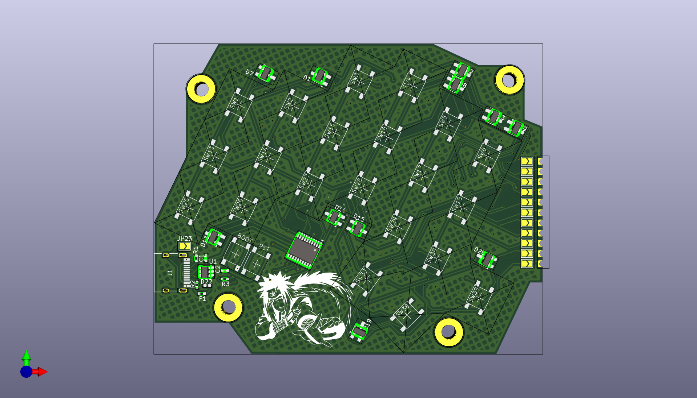
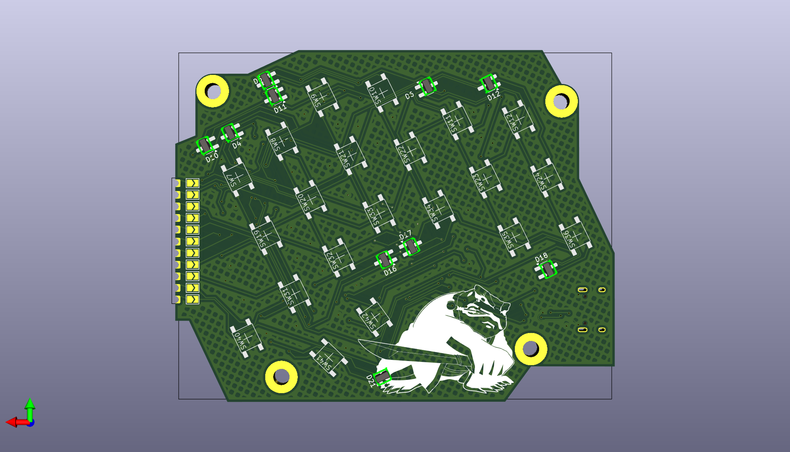

# ToadsTempest

## Intro

I want to be savage, I like Jiraya a lot, I want to participate in a challenge.
This project is in intersection of those three ideas. Also I was surprised about [F.A.K.](https://github.com/semickolon/fak?tab=readme-ov-file) and resourses like [Keyboard Builders' Digest](https://kbd.news/).

So, after some times I make this:

Super small custom 42-keys column-staggered ergonomic mechanical keyboard powered by CH552T microcontroller, created for [pocket keyboard design contest #00](https://chrischrislolo.github.io/orthoLabLogs/pocket-keyboard-design-contest-00.html)

 